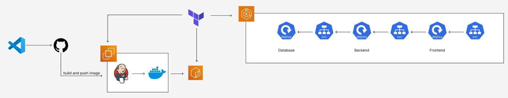

This project is purpose to practice devops skill. Application code in /src is copy from [ microservices-demo ](https://github.com/GoogleCloudPlatform/microservices-demo.git)

  

- [x] Create kubernetes file
- [x] Jenkins to build and push image
- [x] Terraform to create EC2 with Jenkins and Docker
- [ ] Terraform to create ECR
- [ ] Terraform to create EKS
- [ ] Argo CD